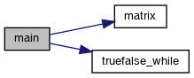

#Лабораторна робота № 8. Вступ до документації проекту

## 1 ВИМОГИ

### 1.1 Розробник

* Курінна Єлизавета Ігорівна;
* студент групи КІТ-121г;
* 18-січ-2021.

### 1.2 Загальне завдання

Розробити функцію, яка буде визначити чи є число простим. Розробити функцію, яка буде виконувати множення раніше згенерованих матриць за допомогою команди псевдовипадкових чисел.

### 1.3 Індивідуальне завдання

23. Визначити, чи є задане ціле число простим.

26. Дано двовимірний масив з 𝑁 × 𝑁 цілих чисел. Помножити матрицю саму на себе

(відповідно до правил множення матриць).

## 2 ОПИС ПРОГРАМИ

### 2.1 Функціональне призначення

Програма призначена для введення любого числа та визначення чи є воно простим. Також програма призначена для передачі псевдовипадкових чисел у двомірний масив та множення один на одного.

При генерації  числа діють наступні *обмеження*:

- якщо дані не передались, то число в програмі використовується за умовчуванням;

Результат зберігається у змінних *n* і *array2*.

Демонстрація знайдених результатів передбачає покрокове виконання програми в режимі налагодження.

### 2.2 Опис логічної структури

Головна функція визиває дві наступні функції: `int truefalse\_while(int n, int i)`; `void matrix(int n1, int array[n1][n1], int array2[n1][n1])`;

Під час генерації масиву:

- для отримання псевдовипадкого чисел використовується наступна конструкція  `array[i][j] = rand()%10`;
- для отримання числа на перевірку `scanf("%d", &n);` 

Опис розроблених структур і функцій наводиться на базі результатів роботи системи автодокументування *Doxygen*.

### 2.2.1 Функція визачення чи є число простим

```c

int truefalse\_while(int n, int i);

```

*Призначення*: визначення чи є число простим за допомогою циклу while.

*Опис роботи*: функції передається число, де виконуються наступні дії за допомогою циклу.

**Аргументи**: 

-*n* — вхідне число або число за умовчуванням, якщо дані не передались.

### 2.2.2 Функція для множення матриці

```c

void matrix(int n1, int array[n1][n1], int array2[n1][n1]);

```

*Призначення*: виконання множення та виведення в відлагоднику результату.

*Опис роботи*: у функцію передається масив, який був заповнений псевдовипадковими числами, за допомогою циклів виконується множення

**Аргументи**:

- *array* - масив з псевдовипадковими числами, який передається з головної функції.
- *n* – розмір масиву.
- *array2* — виведення результату множення в цей масив. 


###2.2.3 Основна функція

```c

int main()

```

*Призначення*: головна функція.

*Опис роботи*:

-задання вхідних даних, якщо дані не передались - у цьому випадку вони матимуть значення за замовчуванням;
- створення масиву за допомогою генератора псевдовипадкових чисел;
- вивід в перемінну while1  значення  чи є число простим за допомогою функції  `truefalse_while`;
- вивід даних масива після множення за допомогою функції  `matrix`;
- повертає функція код повернення з програми (0).


####2.2.4 Структура проекту

```

        └── lab08

            ├── Doxyfile

            ├── Makefile

            ├── README.md

            ├── doc

            │   ├── lab08.pdf

             │   ├── lab08.docx

            │   └── lab08.md

            ├── src

            │   └── main.c

            └── dist

                └── html/

```

### 2.3 Важливі фрагменти програми

#### 2.3.1 Початкові дані. Константи, перерахування

```c

int while1;
const int n3 = 3;
int n = 7;
int array[n3][n3];
int array2[n3][n3];

```

#### 2.3.2 Генерація масиву array

```c
for(int i = 0; i < n3; i++){
for(int j= 0;j<n3; j++){
array[i][j] = rand()%10; 

```

#### 2.3.3 Введення власних даних 

```c

printf("Input your number:");
scanf("%d", &n);

```

## 3 ВАРІАНТИ ВИКОРИСТАННЯ

Для демонстрації результатів кожної задачі використовується:

- покрокове виконання програми в утиліті lldb.

**Варіант використання 1**: послідовність дій для запуску програми у режимі відлагодження:

- запустити програму у відлагоднику lldb;
- поставити точку зупинки на функції main (строка з `return 0;`);
- запустити програму;
- подивитись результати виконання програми, оглядаючи значення змінної *while1* і *array2*:

```
Input your number:11

Process 4639 stopped

\* thread #1, name = 'main.bin', stop reason = breakpoint 1.1 2.1

frame #0: 0x000000000040122c main.bin`main at main.c:54:1
51  	
52  		while1 = truefalse\_while( n, 2);
53  		matrix(n3, array, array2);}}
-> 54  	return 0;}
55  	
56  	/\*\*
57  	 \* Визначення чи є число простим

(lldb) p while1
(int) $0 = 1
(lldb) p array2
(int [3][3]) $1 = {
[0] = ([0] = 81, [1] = 50, [2] = 114)
[1] = ([0] = 60, [1] = 49, [2] = 95)
[2] = ([0] = 82, [1] = 60, [2] = 133)

```

## ВИСНОВКИ

При виконанні даної лабораторної роботи було набуто практичного досвіду роботи з масивами, циклами та функціями, також навчилась працювати з документуванням проекту.

